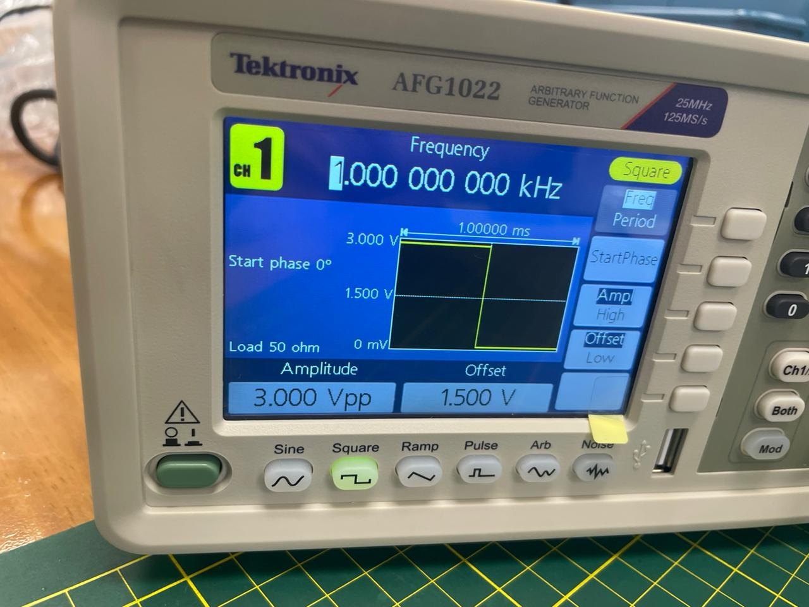
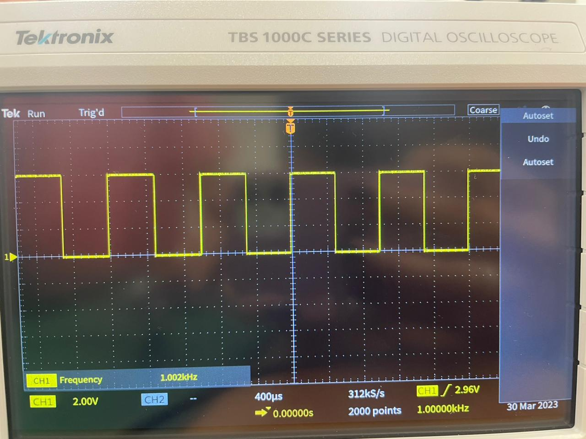
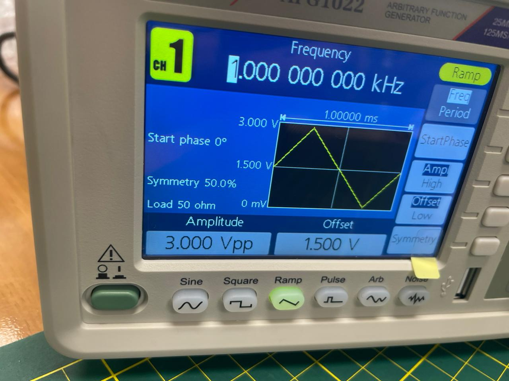
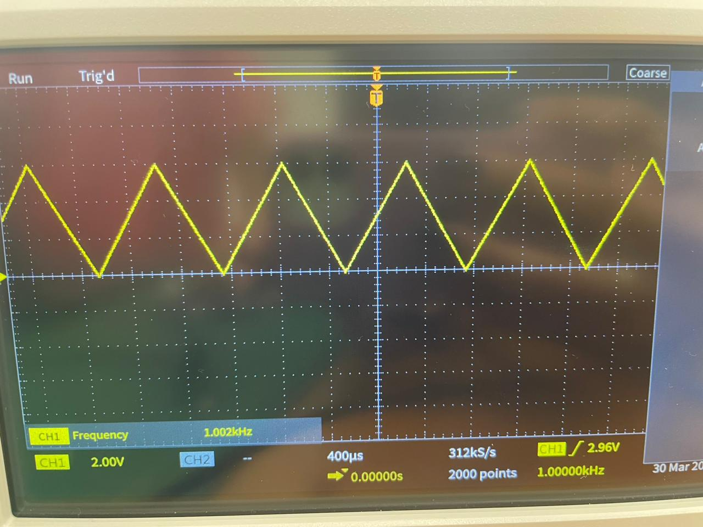

# Señal Cuadrada
Frecuencia: 1KHz

Amplitud: 3 Vpp

Offset 1.5V

| Materiales             | Imagen referencial                                              |
| ----------------- | ------------------------------------------------------------------ |
### Imagen generador

#

### Imagen osciloscopio

# Señal Triangular
Frecuencia: 1KHz

Amplitud: 3 Vpp

Offset 1.5V

### Imagen generador

#

### Imagen osciloscopio

