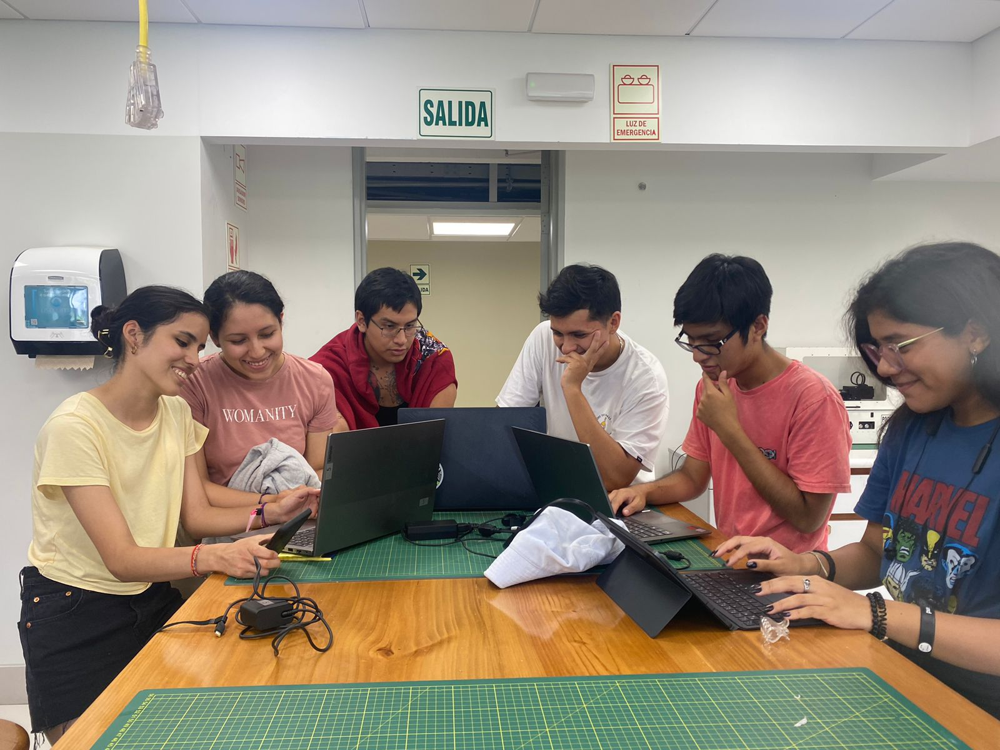

# 📈📉 Introducción a Señales Biomédicas - Grupo 3

## Tabla de contenidos:
* [Señales Biomédicas](https://github.com/EduMV/ISB-G3/blob/main/README.md#se%C3%B1ales-biom%C3%A9dicas)
* [Curso de Introducción a Señales Biomédicas](https://github.com/EduMV/ISB-G3/blob/main/README.md#curso-de-introducci%C3%B3n-a-se%C3%B1ales-biom%C3%A9dicas)
* [Unidades del curso](https://github.com/EduMV/ISB-G3/blob/main/README.md#unidades-del-curso)
* [Nosotros](https://github.com/EduMV/ISB-G3/blob/main/README.md#nosotros)
* [Integrantes](https://github.com/EduMV/ISB-G3/blob/main/README.md#integrantes)
* [Foto grupal](https://github.com/EduMV/ISB-G3/blob/main/README.md#foto-grupal)

# 
### Señales Biomédicas
Las señales biomédicas representan una gran herramienta para monitorizar la salud de los pacientes así como tratar enfermedades y mejorar las condiciones de salud y vida. En la actualidad existen diferentes instrumentos que otorgan un acceso metrológico a estas señales lo que permite la evaluación de diferentes condiciones. Estos rasgos son indispensables como objetivo de desarrollo en los ámbitos médicos actuales  por lo que su investigación tecnológica posee una gran importancia de desarrollo en salud. 
# 

### Curso de Introducción a Señales Biomédicas
Este curso desarrollará los conocimientos necesarios para el tratamiento de señales provenientes de dispositivos médicos. Se abordaron temas como: el estudio de los sensores, la tecnología de adquisición, los procesos clínicos en los que se dan y protocolos que se usan para compartir la información entre los diferentes equipos que brindan señales. Las clases se desarrollarán en un laboratorio donde se complementará la teoría brindada con simulaciones en computadora utilizando programas desarrollados en Python y kits de desarrollo para la adquisición de bioseñales.

# 

### Unidades del curso
1. Introducción, adquisición y principios fisiológicos de las señales biomédicas
2. Análisis de ECG, EMG y EEG
3. Introducción al tratamiento digital de señales
4. Informática biomédica e introducción a la inteligencia artificial en señales biomédicas

# 
### Nosotros
Somos un grupo de estudiantes de la carrera de Ingeniería Biomédica de la Pontificia Universidad Católica del Perú y la Universidad Peruana Cayetano Heredia con mucho interés en aprender sobre cómo funcionan los equipos de medición de señales biomédicas, cómo se procesa la información y cómo se pueden aplicar en diferentes campos de la medicina.

# 
### Integrantes:

**Gonzalo Povea:**

Estudiante de la carrera de Ingeniería Biomédica con aptitudes para el trabajo en equipo, la investigación y el desarrollo de proyectos relacionados con la salud que aporten una mejor calidad de vida. Apasionado por la electrónica, mecánica y manufactura digital 3D. 

**Edu Marin:**

Estudiante de Ingeniería Biomédica con interés en la rama de Señales e Imágenes Biomédicas. Aptitudes para el desarrollo de software y diseño electrónico aplicados a la tecnología en salud.

**Maria Miranda:**

Estudiante de Ingeniería Biomédica cursando el séptimo ciclo de la carrera con especial interés en la rama de Ingeniería Clínica y aptitudes para el trabajo en equipo y la organización, ademas de la programación.  

**Fernando Panduro:**

Estudiante de Ingeniería Biomédica con particular interés en la Ingeniería Clínica, Arquitectura e Ingeniería Hospitalaria, y Gestión de Tecnologías en Salud. Cuento con aptitudes para la investigación, el trabajo en equipo y desarrollo de conocimientos. 

**Fernanda Ramirez:**

Estudiante de Ingeniería Biomédica interesada en las ramas de Ingeniería de tejidos e Ingeniería Clínica. Motivada a ser parte del cambio en el sector salud a través de la creación de nuevas alternativas rápidas, eficaces y que puedan ser económicamente accesibles para más personas.

**Ximena Roldán:**

Estudiante de ingeniería biomédica aspira poder cambiar el sistema de salud de su país en la rama de Ingeniería clínica.

# 
### Foto grupal

#
### Recursos
| Material             | Imagen referencial                                              |
| ----------------- | ------------------------------------------------------------------ |
| *Arduino nano 33 loT* es una placa de desarrollo de tamaño reducido que integra capacidades de conectividad inalámbrica, procesamiento de datos y sensores, diseñada para proyectos de Internet de las cosas (IoT) que requieren baja potencia y alta eficiencia energética.
 |  #0a192f |

